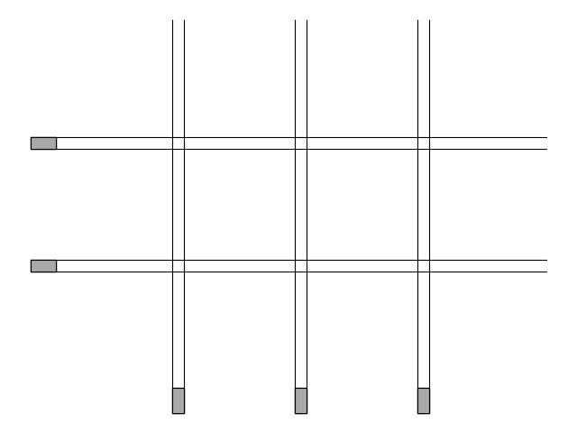
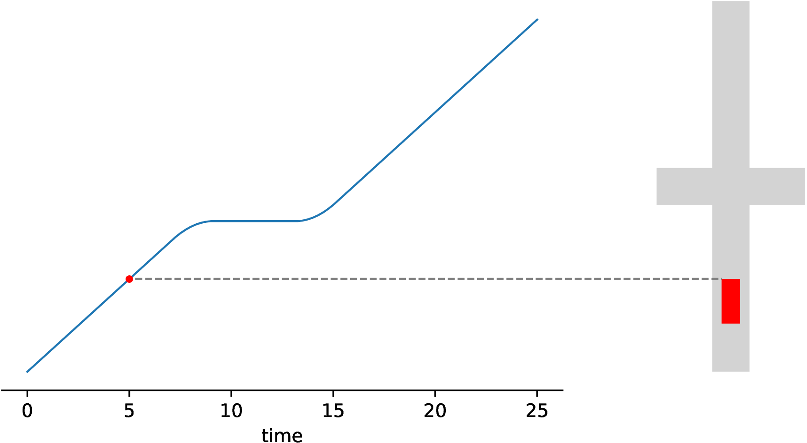
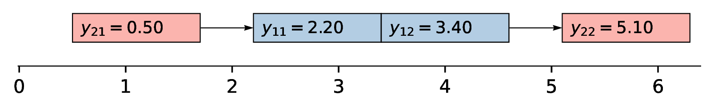

## 🚘 Autonomous Intersection Coordination

> How to optimally guide autonomous vehicles through a dense network of intersections?

Suppose you can control every autonomous vehicle in a certain neighborhood of tightly interconnected intersections, maybe something like downtown Manhattan.
Assume that every driver (or rather, *passenger* in this scenario) has communicated their next destination, then how would we have to guide all vehicles in order to optimize measures such as overall travel time and energy efficiency? 

Autonomous vehicle technology has seen rapid advancement, making such large-scale coordinated traffic control an increasingly relevant problem.
There are many modeling facets to this problem, but this project focuses on simple grid-like networks of intersections, in which vehicles can only move in four cardinal directions.
It is assumed that vehicles have predetermined routes.
Furthermore, we assume that vehicles can be controlled with perfect precision, and that there is a centralized controller that can prescribe the exact trajectory of each vehicle.
The main questions we seek to answer are:

1. In which order should vehicles cross intersections?
2. How to control the speed of each vehicle?

<!--  -->

## 📈 Motion Planning

Mathematically, the coordination problem can be defined as finding an optimal set of collision-free trajectories.
When we define "optimal" to mean "minimizing the total delay of all vehicles", it turns out that we have to use a "bang-off-bang" speed control stategy, which means that vehicles should either accelerate at maximum rate, decelerate at maximum rate, or maintain their current speed.
Finding the precise timing of these bang-off-bang control actions can be done using a direct transcription method, which discretizes the trajectory of each vehicle into a finite number of segments, and formulates the motion planning problem as a large linear program.

The constraint that enforces a safety distance between vehicles on the same route distinguishes this motion planning problem from classical optimal control problems that can be solved analytically using the Pontryagin Maximum Principle.
We have implemented an algebraic method that "glues together" a finite number of polynomial trajectory segments, which results in a couple of quadratic equations that can be solved symbolically using the `sympy` library.
Although the results seem to be plausible when compared to direct transcription, we have no clear strategy for proving the correctness of this approach.

<!--  -->

## 🔢 Crossing Order Scheduling

In the delay minimization setting, the motion planning problem is completely independent of the crossing order problem, which means that the latter can thus be solved using integer programming.
However, since this method scales poorly, we also investigate various heuristics that are based on a step-by-step schedule construction approach.
We find that a simple one-parameter threshold policy achieves surprisingly good results.
Furthermore, we investigate policies parameterized by neural networks, which are trained using imitation learning and reinforcement learning.
The results suggest that the neural policies offer limited additional benefit compared to the simple threshold policy.
Our hypothesis is that our simple neural network architecture is not suited to capture the combinatorial structure of the crossing order problem, and that more specialized architectures (e.g., using attention mechanisms) is required for better performance.

<!--  -->

## 📚 Thesis

[Efficient and Provably Safe Autonomous Intersection Coordination](report/thesis.pdf)

**Abstract**: The growing adoption of autonomous vehicles motivates the need for systems that coordinate joint motion across traffic networks, aiming to reduce travel time, fuel consumption, and improve comfort. We study this coordination problem under ideal conditions, assuming perfect communication and a centralized controller that prescribes precise vehicle trajectories. Focusing on intersection management, we identify the determination of optimal crossing orders as a key combinatorial challenge. Formulating delay minimization as a scheduling problem, we develop an integer programming model and introduce two types of cutting planes that significantly accelerate solution time for single-intersection cases. As exact optimization scales poorly, we investigate step-by-step scheduling as a basis for fast heuristics. For a single intersection, a simple one-parameter threshold policy achieves less than 2% and 10% optimality gaps for two and three crossing routes, respectively, with up to 60 vehicles per route. Neural network policies trained via imitation and reinforcement learning offer limited additional benefit. Finally, we outline challenges in extending the framework to networks of intersections, particularly in modeling finite lane capacities, and present preliminary insights into how finite lane capacity defines the space of feasible crossing time schedules. 

## 📂 Project Organization

Below is a brief overview of some important files and directories in this repository:

- **notebooks/** - Jupyter notebooks for visualizations and experiments
    - **single/experiments.ipynb** - Main experiments for a single intersection, which invokes the different strategies from the **src/traffic_scheduling/single/** directory
    - **configuration-space.ipynb** - Numerical computation of the configuration space for a single intersection
    - **presentation.ipynb** - Programmatic figure generation for the final presentation
- **src/traffic_scheduling/single/** - Main experiments for a single intersection
    - **basics.ipynb** - Problem instance generation and basic integer programming procedure with cutting planes
    - **mdp.py** - Markov decision process (MDP) formulation of the crossing order scheduling problem
    - **imitation.ipynb** - Constructive scheduling with imitation learning, using a recursive neural network (RNN) policy parameterization
    - **ppo.ipynb** - Constructive scheduling with reinforcement learning (PPO), using the default neural network policy parameterization provided by the *stable-baselines3* library
    - **threshold.ipynb** - Constructive scheduling using a simple one-parameter threshold policy that is fitted using grid search
- **src/traffic_scheduling/network/** - Extensions of experiments to a network of intersections
    - **basics.ipynb** - Problem instance generation and basic integer programming procedure with cutting planes
    - **mdp.py** - Markov decision process (MDP) formulation of the crossing order scheduling problem for multiple intersection, in which states are encoded as  disjunctive graphs
- **src/traffic_scheduling/motion.py** - Solving the optimal control problem using a direct transcription method
- **report/** - Thesis and miscellaneous personal notes
