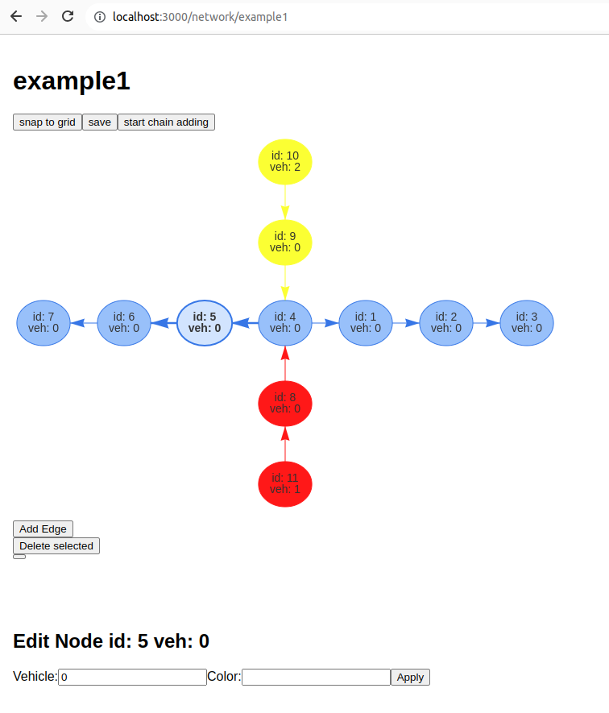

# Network Editor

- build with Meteor.js
- networks are stored in MongoDB
- network drawing and manipulation based on vis-network
- chain adding: click to extend the current chain by adding a new node
- snap to grid function
- node properties: vehicle number (used to distinguish type) and color (no semantics, just eye candy)

